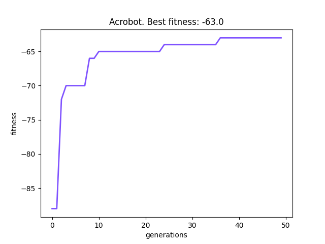
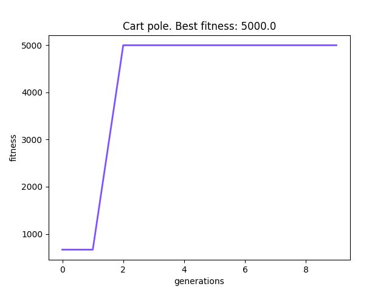
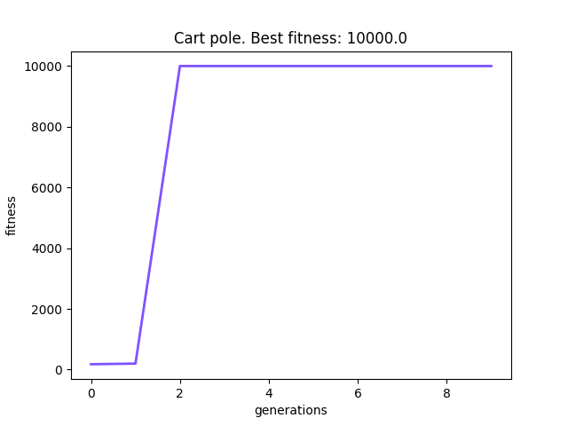
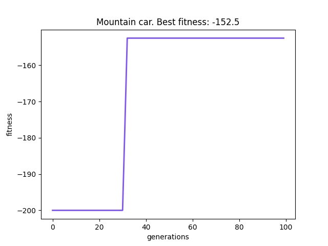
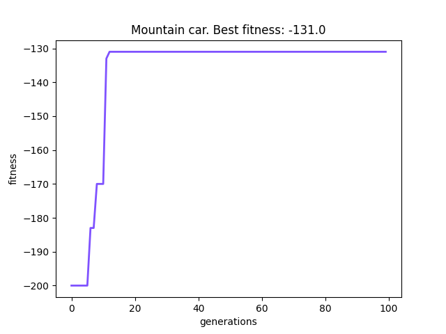
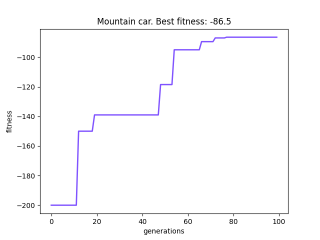

# Reinforcement Learning with Neuroevolution HW

## Algorithm:

I've mostly used NEAT with a slight modification - I run each genome 2 times and choose the worst of those runs

## Solved problems:

### Acrobot
The solution was not really complicated, basic config from the documentation (apart from number of inputs
  and outputs) sufficed

  
---
### Cart-pole
A bit suspicious. It basically grew to whatever number I've set the upper limit to.

---
### Mountain car
It was the tricker one. I found that increasing elitism dealt better results.

## Navigating sources:
You will find the solutions to each problem under a correspoding directory containing:
- `main.py` - code of the solutions which is mostly similar for all problems
- `config` - configuration for `neat-python`
- `graph*.png` - images of graphs

Additinaly there is a utility file `graph_reporter.py` which contains a class which helps to draw graphs